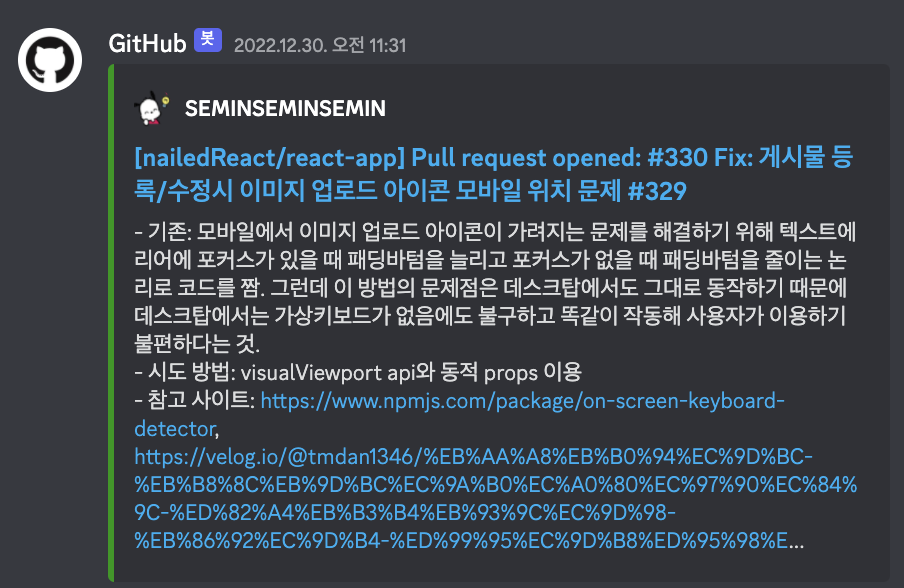
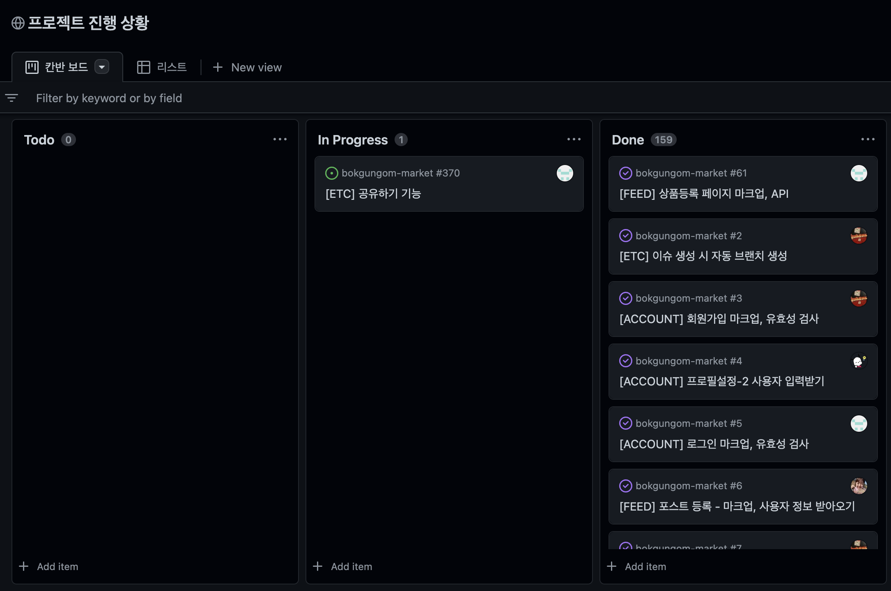

# 득근득근 복근곰마켓 🐻‍❄️

[🔗 복근곰마켓 바로가기](https://bokgungom-market.netlify.app/)

## 💪 프로젝트 소개

- 💪 복근곰 마켓 서비스는 운동을 즐기는 사람들을 위한 SNS입니다.
- 🏋️ 운동과 관련한 상품들을 업로드하여 판매할 수 있습니다.
- 🏞️ 상품을 등록하지 않아도 일상을 공유하며 즐거운 SNS 활동을 할 수 있습니다.
- ✏️ 글과 사진과 함께 게시물을 작성하여 자신의 일상을 공유하고 운동 인증을 할 수도 있습니다.
- ❤️ 다른 사용자를 팔로우하여 소식을 공유할 수 있고 댓글과 좋아요를 통해 소통할 수 있습니다.

<br>

- 프로젝트 개발 기간: 2022-12-07 ~ 2023-01-04

<br>

## 🫂 팀 소개

- 멋쟁이사자처럼 프론트엔드 스쿨 3기 프로젝트 15조 `15조는 리액트를 찢오`입니다.


|<span style="font-size:16px">정수현</span>|<span style="font-size:16px">강세민</span>|<span style="font-size:16px">김성준</span>|<span style="font-size:16px">한혜지</span>|
|:-:|:-:|:-:|:-:|
|<a href="https://github.com/sasha1107"></a>|<a href="https://github.com/SEMINSEMINSEMIN"></a>|<a href="https://github.com/sjkymy"></a>|<a href="https://github.com/hyejee0504"></a>|

<br>

## ⚙️ 개발 환경

<table>
      <thead align="center">
        <tr>
          <th colspan="2" style="text-align:center;"><span style="font-size:16px;">프론트엔드</span></th>
          <th style="text-align:center;"><span style="font-size:16px">백엔드</span></th>
          <th style="text-align:center;"><span style="font-size:16px">배포</span></th>
          <th colspan="2" style="text-align:center;"><span style="font-size:16px;">디자인</span></th>
        </tr>
      </thead>
      <tbody>
        <tr>
          <td align="center" style="text-align:center;">
            <a href="https://reactjs.org/" target="_blank"></a>
            <br>
            <code>React</code>
          </td>
          <td align="center" style="text-align:center; margin: 0 auto;">
            <a href="https://styled-components.com/" target="_blank"></a>
            <br>
            <code>styled-components</code>
          </td>
          <td style="text-align:center;">제공된 API 사용</td>
          <td align="center" style="text-align:center;">
            <a href="https://www.netlify.com/" target="_blank"></a>
            <br>
            <code>Netlify</code>
          </td>
          <td align="center" style="text-align:center; margin: 0 auto;">
            <a href="https://www.adobe.com/kr/products/photoshop/landpa.html?gclid=Cj0KCQiA5NSdBhDfARIsALzs2EDDufpNAEYRcvM4knMcv6wZDXh2ZI8-4n74LBIJefRgHhmJ1PH_i6IaAtcUEALw_wcB&sdid=TBJRLR9V&mv=search&ef_id=Cj0KCQiA5NSdBhDfARIsALzs2EDDufpNAEYRcvM4knMcv6wZDXh2ZI8-4n74LBIJefRgHhmJ1PH_i6IaAtcUEALw_wcB:G:s&s_kwcid=AL!3085!3!460585117877!e!!g!!photoshop!97967719!4837432399" target="_blank"></a>
            <br>
            <code>Adobe Photoshop</code>
          </td>
          <td align="center" style="text-align:center; margin: 0 auto;">
            <a href="https://www.figma.com/" target="_blank"></a>
            <br>
            <code>Figma</code>
          </td>
        </tr>
      </tbody>
</table>
<br>

### ⛓️ node modules
|모듈명|용도|
|-|-|
|react-router-dom|페이지 라우팅을 위해 사용|
|axios|서버와 통신을 위해 사용|
|react-intersection-observer| 무한 스크롤 구현을 위해 사용 |
|styled-reset| 스타일 구현의 편의를 위해 사용 |
|uuid| 컴포넌트 리스트의 유니크한 key 생성을 위해 사용 |

<br>

## <a href="https://github.com/nailedReact/bokgungom-market/wiki/%ED%98%91%EC%97%85-&-%EB%B8%8C%EB%9E%9C%EC%B9%98-%EC%83%9D%EC%84%B1-%EA%B0%80%EC%9D%B4%EB%93%9C" target="_blank">🤝 협업 방식</a>

1. 프로젝트 노션 페이지 내 남은 작업 목록에서 원하는 작업을 분담합니다.
2. 해당하는 업무에 대해 **GitHub Issue**를 생성합니다.
3. GitHub Actions에 의해 자동으로 생성된 브랜치로 전환하여 해당하는 업무를 진행합니다.
4. 작업을 완료하면 작업한 브랜치에서(main브랜치 X) 코드를 push합니다.
5. **PR(Pull Request)** 을 오픈합니다.
- PR(pull request)을 오픈하면, 푸시한 사람 외 다른 팀원 1명이 코드를 확인하고 승인합니다.
- PR이 오픈되면 다른 팀원들이 바로 확인할 수 있도록 디스코드 웹 훅 설정을 통해 팀 채팅방으로 알람을 받을 수 있도록 했습니다.

- 코드 리뷰 & 승인은 생산성을 위해 리뷰어를 1명으로 지정하되, 팀원들이 코드 스타일을 공유하며 서로 잘 이해할 수 있도록 순서를 정해 돌아가며 골고루 리뷰하도록 했습니다.

    - 컨펌 순서
        - **성준** : `수현` → `세민` → `혜지`
        - **수현** : `성준` → `혜지` → `세민`
        - **세민** : `혜지` → `수현` → `성준`
        - **혜지** : `세민` → `성준` → `수현`

6. PR이 merge되어 close 되면 해당 이슈는 자동으로 Done상태로 변경됩니다.

<br>

## 📊 프로젝트 진행 상황 관리

- <a href="https://github.com/nailedReact/bokgungom-market/issues?q=is%3Aissue+is%3Aclosed" target="_blank">🔘 GitHub Issues</a>
    - 간편한 이슈 생성을 위해 이슈 템플릿을 만들어 사용했습니다.
    - 이슈 템플릿으로 어떤 이슈인지, 어떤 페이지에 해당하는 지, 구현 해야 하는 내용이 무엇인지를 적도록 했습니다.
    
    - 팀원이 현재 어떤 작업을 진행하고 있는지를 바로 알 수 있어 의사소통 비용을 줄일 수 있었습니다. 
- <a href="https://github.com/orgs/nailedReact/projects/1/views/1" target="_blank">🗂️ GitHub Projects</a>
    - 칸반 보드로 프로젝트 진행 상황을 한 눈에 확인할 수 있어 일정을 관리하기 수월했습니다.
    

<br>

## 🔀 브랜치 전략

### 👍 GitHub Flow 전략


- 개발과 동시에 지속적으로 배포를 진행할 것이 아니라, 기능을 모두 개발하고 최종적으로 배포를 할 예정이었기 때문에 Git Flow 전략보다는 GitHub Flow 전략이 적합하다고 생각했습니다.
- 프로젝트 기간 동안 팀원들이 같은 시간에 작업하기 때문에 잦은 충돌이 발생할 것을 우려하여 충돌의 크기를 줄이고자 GitHub Flow 전략을 채택하여 작은 단위로 이슈를 쪼개 이슈 별로 브랜치를 분기하고 main 브랜치에 지속적으로 merge 하는 방식으로 진행했습니다.

### 🚀 GitHub Action - 브랜치 생성 자동화


- [Create Issue Branch](https://github.com/marketplace/actions/create-issue-branch)
- 이슈를 생성하면 GitHub Action으로 해당 이슈에 해당하는 브랜치가 자동으로 생성되도록 설정하여 브랜치명을 고민하고 브랜치를 생성하는 시간을 줄였습니다.
    - [브랜치 자동화 설정 상세 내용](https://github.com/nailedReact/react-app/wiki/%EB%B8%8C%EB%9E%9C%EC%B9%98-%EC%9E%90%EB%8F%99%ED%99%94-%EC%84%A4%EC%A0%95-%EB%82%B4%EC%9A%A9)
    
- 예) 자동 생성된 브랜치를 pull 하고 ```git checkout -t origin/feat/issue-81```하여 해당 브랜치로 이동합니다.
- [브랜치 history](https://github.com/nailedReact/react-app/blob/main/preview/git%20branch%20history.png)

<br>

## 컨벤션

팀원 간의 원활한 소통과 협업을 위해 커밋 컨벤션과, 코드 컨벤션을 만들어 이를 따랐습니다.


### [🔗 커밋 컨벤션](https://github.com/nailedReact/bokgungom-market/wiki/%EC%BB%A4%EB%B0%8B-%EC%BB%A8%EB%B2%A4%EC%85%98)
- 다양한 사례를 참고하여 프로젝트에서 주로 쓰일 것 같은 커밋 유형을 간추려 컨벤션으로 지정했습니다.


### [🔗 코드 컨벤션](https://github.com/nailedReact/bokgungom-market/wiki/%EC%BD%94%EB%93%9C-%EC%BB%A8%EB%B2%A4%EC%85%98)
- 리액트 코딩에 주로 쓰이는 컨벤션을 참고하여 저희 조만의 코드 컨벤션을 만들었습니다.
- 문자열 처리 시 쌍따옴표/홑따옴표의 사용, 혹은 문장 끝 세미콜론의 사용여부와 같은 개인적 취향이 반영될 수 있는 항목들의 경우에는 사전 설문을 통해 다수결에 따라 지정했습니다. 

<br>

## 페이지 미리보기

<table width="100%">
<tr>
    <th colspan="2">스플래시 페이지</th>
</tr>

<tr align="center">
    <td valign="top" width="66%">
    스플래시(데스크탑 🖥️)
    </td>
    <td valign="top" width="33%">
    스플래시(모바일 📱)
    </td>
</tr>

<tr>
    <td valign="top" width="75%">
    <a href="https://github.com/nailedReact/react-app/wiki/%EB%B3%B5%EA%B7%BC%EA%B3%B0%EB%A7%88%EC%BC%93-%ED%8E%98%EC%9D%B4%EC%A7%80-%EC%84%A4%EB%AA%85#%EC%8A%A4%ED%94%8C%EB%9E%98%EC%8B%9C-%ED%8E%98%EC%9D%B4%EC%A7%80"></a>
    </td>
    <td valign="top" width="25%">
    <a href="https://github.com/nailedReact/react-app/wiki/%EB%B3%B5%EA%B7%BC%EA%B3%B0%EB%A7%88%EC%BC%93-%ED%8E%98%EC%9D%B4%EC%A7%80-%EC%84%A4%EB%AA%85#%EC%8A%A4%ED%94%8C%EB%9E%98%EC%8B%9C-%ED%8E%98%EC%9D%B4%EC%A7%80"></a>
    </td>
</tr>

<tr>
    <th colspan="2">회원가입 페이지</th>
</tr>

<tr align="center">
    <td valign="top" width="66%">
    회원가입(데스크탑 🖥️)
    </td>
    <td valign="top" width="33%">
    회원가입(모바일 📱)
    </td>
</tr>

<tr>
    <td valign="top" width="75%">
    <a href="https://github.com/nailedReact/react-app/wiki/%EB%B3%B5%EA%B7%BC%EA%B3%B0%EB%A7%88%EC%BC%93-%ED%8E%98%EC%9D%B4%EC%A7%80-%EC%84%A4%EB%AA%85#%ED%9A%8C%EC%9B%90%EA%B0%80%EC%9E%85"></a>
    </td>
    <td valign="top" width="25%">
    <a href="https://github.com/nailedReact/react-app/wiki/%EB%B3%B5%EA%B7%BC%EA%B3%B0%EB%A7%88%EC%BC%93-%ED%8E%98%EC%9D%B4%EC%A7%80-%EC%84%A4%EB%AA%85#%ED%9A%8C%EC%9B%90%EA%B0%80%EC%9E%85"></a>
    </td>
</tr>

<tr>
    <th colspan="2">로그인 페이지</th>
</tr>

<tr align="center">
    <td valign="top" width="66%">
    로그인(데스크탑 🖥️)
    </td>
    <td valign="top" width="33%">
    로그인(모바일 📱)
    </td>
</tr>

<tr>
    <td valign="top" width="75%">
    <a href="https://github.com/nailedReact/react-app/wiki/%EB%B3%B5%EA%B7%BC%EA%B3%B0%EB%A7%88%EC%BC%93-%ED%8E%98%EC%9D%B4%EC%A7%80-%EC%84%A4%EB%AA%85#%EB%A1%9C%EA%B7%B8%EC%9D%B8"></a>
    </td>
    <td valign="top" width="25%">
    <a href="https://github.com/nailedReact/react-app/wiki/%EB%B3%B5%EA%B7%BC%EA%B3%B0%EB%A7%88%EC%BC%93-%ED%8E%98%EC%9D%B4%EC%A7%80-%EC%84%A4%EB%AA%85#%EB%A1%9C%EA%B7%B8%EC%9D%B8"></a>
    </td>
</tr>

<tr>
    <th colspan="2">홈 피드 페이지</th>
</tr>

<tr align="center">
    <td valign="top" width="66%">
    홈 피드(데스크탑 🖥️)
    </td>
    <td valign="top" width="33%">
    홈 피드(모바일 📱)
    </td>
</tr>

<tr>
    <td valign="top" width="75%">
    <a href="https://github.com/nailedReact/react-app/wiki/%EB%B3%B5%EA%B7%BC%EA%B3%B0%EB%A7%88%EC%BC%93-%ED%8E%98%EC%9D%B4%EC%A7%80-%EC%84%A4%EB%AA%85#%ED%99%88-%ED%94%BC%EB%93%9C"></a>
    </td>
    <td valign="top" width="25%">
    <a href="https://github.com/nailedReact/react-app/wiki/%EB%B3%B5%EA%B7%BC%EA%B3%B0%EB%A7%88%EC%BC%93-%ED%8E%98%EC%9D%B4%EC%A7%80-%EC%84%A4%EB%AA%85#%ED%99%88-%ED%94%BC%EB%93%9C"></a>
    </td>
</tr>


<tr>
    <th colspan="2">게시글 상세 보기 + 댓글 페이지 </th>
</tr>

<tr align="center">
    <td valign="top" width="66%">
    게시글 상세 보기 + 댓글(데스크탑 🖥️)
    </td>
    <td valign="top" width="33%">
    게시글 상세 보기 + 댓글(모바일 📱)
    </td>
</tr>

<tr>
    <td valign="top" width="75%">
    <a href="https://github.com/nailedReact/react-app/wiki/%EB%B3%B5%EA%B7%BC%EA%B3%B0%EB%A7%88%EC%BC%93-%ED%8E%98%EC%9D%B4%EC%A7%80-%EC%84%A4%EB%AA%85#%EA%B2%8C%EC%8B%9C%EA%B8%80-%EC%83%81%EC%84%B8-%EB%B3%B4%EA%B8%B0--%EB%8C%93%EA%B8%80"></a>
    </td>
    <td valign="top" width="25%">
    <a href="https://github.com/nailedReact/react-app/wiki/%EB%B3%B5%EA%B7%BC%EA%B3%B0%EB%A7%88%EC%BC%93-%ED%8E%98%EC%9D%B4%EC%A7%80-%EC%84%A4%EB%AA%85#%EA%B2%8C%EC%8B%9C%EA%B8%80-%EC%83%81%EC%84%B8-%EB%B3%B4%EA%B8%B0--%EB%8C%93%EA%B8%80"></a>
    </td>
</tr>

<tr>
    <th colspan="2">게시글 업로드 페이지</th>
</tr>

<tr align="center">
    <td valign="top" width="66%">
    게시글 업로드(데스크탑 🖥️)
    </td>
    <td valign="top" width="33%">
    게시글 업로드(모바일 📱)
    </td>
</tr>

<tr>
    <td valign="top" width="75%">
    <a href="https://github.com/nailedReact/react-app/wiki/%EB%B3%B5%EA%B7%BC%EA%B3%B0%EB%A7%88%EC%BC%93-%ED%8E%98%EC%9D%B4%EC%A7%80-%EC%84%A4%EB%AA%85#%EA%B2%8C%EC%8B%9C%EA%B8%80-%EC%97%85%EB%A1%9C%EB%93%9C"></a>
    </td>
    <td valign="top" width="25%">
    <a href="https://github.com/nailedReact/react-app/wiki/%EB%B3%B5%EA%B7%BC%EA%B3%B0%EB%A7%88%EC%BC%93-%ED%8E%98%EC%9D%B4%EC%A7%80-%EC%84%A4%EB%AA%85#%EA%B2%8C%EC%8B%9C%EA%B8%80-%EC%97%85%EB%A1%9C%EB%93%9C"></a>
    </td>
</tr>

<tr>
    <th colspan="2">상품 업로드 페이지</th>
</tr>

<tr align="center">
    <td valign="top" width="66%">
    상품 업로드(데스크탑 🖥️)
    </td>
    <td valign="top" width="33%">
    상품 업로드(모바일 📱)
    </td>
</tr>

<tr>
    <td valign="top" width="75%">
    <a href="https://github.com/nailedReact/react-app/wiki/%EB%B3%B5%EA%B7%BC%EA%B3%B0%EB%A7%88%EC%BC%93-%ED%8E%98%EC%9D%B4%EC%A7%80-%EC%84%A4%EB%AA%85#%EC%83%81%ED%92%88-%EC%97%85%EB%A1%9C%EB%93%9C"></a>
    </td>
    <td valign="top" width="25%">
    <a href="https://github.com/nailedReact/react-app/wiki/%EB%B3%B5%EA%B7%BC%EA%B3%B0%EB%A7%88%EC%BC%93-%ED%8E%98%EC%9D%B4%EC%A7%80-%EC%84%A4%EB%AA%85#%EC%83%81%ED%92%88-%EC%97%85%EB%A1%9C%EB%93%9C"></a>
    </td>
</tr>

<tr>
    <th colspan="2">검색 페이지</th>
</tr>

<tr align="center">
    <td valign="top" width="66%">
    검색(데스크탑 🖥️)
    </td>
    <td valign="top" width="33%">
    검색(모바일 📱)
    </td>
</tr>

<tr>
    <td valign="top" width="75%">
    <a href="https://github.com/nailedReact/react-app/wiki/%EB%B3%B5%EA%B7%BC%EA%B3%B0%EB%A7%88%EC%BC%93-%ED%8E%98%EC%9D%B4%EC%A7%80-%EC%84%A4%EB%AA%85#%EA%B2%80%EC%83%89"></a>
    </td>
    <td valign="top" width="25%">
    <a href="https://github.com/nailedReact/react-app/wiki/%EB%B3%B5%EA%B7%BC%EA%B3%B0%EB%A7%88%EC%BC%93-%ED%8E%98%EC%9D%B4%EC%A7%80-%EC%84%A4%EB%AA%85#%EA%B2%80%EC%83%89"></a>
    </td>
</tr>


<tr>
    <th colspan="2">프로필 페이지</th>
</tr>

<tr align="center">
    <td valign="top" width="66%">
    프로필(데스크탑 🖥️)
    </td>
    <td valign="top" width="33%">
    프로필(모바일 📱)
    </td>
</tr>

<tr>
    <td valign="top" width="75%">
    <a href="https://github.com/nailedReact/react-app/wiki/%EB%B3%B5%EA%B7%BC%EA%B3%B0%EB%A7%88%EC%BC%93-%ED%8E%98%EC%9D%B4%EC%A7%80-%EC%84%A4%EB%AA%85#%ED%94%84%EB%A1%9C%ED%95%84"></a>
    </td>
    <td valign="top" width="25%">
    <a href="https://github.com/nailedReact/react-app/wiki/%EB%B3%B5%EA%B7%BC%EA%B3%B0%EB%A7%88%EC%BC%93-%ED%8E%98%EC%9D%B4%EC%A7%80-%EC%84%A4%EB%AA%85#%ED%94%84%EB%A1%9C%ED%95%84"></a>
    </td>
</tr>

<tr>
    <th colspan="2">프로필 수정 페이지</th>
</tr>

<tr align="center">
    <td valign="top" width="66%">
    프로필 수정(데스크탑 🖥️)
    </td>
    <td valign="top" width="33%">
    프로필 수정(모바일 📱)
    </td>
</tr>

<tr>
    <td valign="top" width="75%">
    <a href="https://github.com/nailedReact/react-app/wiki/%EB%B3%B5%EA%B7%BC%EA%B3%B0%EB%A7%88%EC%BC%93-%ED%8E%98%EC%9D%B4%EC%A7%80-%EC%84%A4%EB%AA%85#%ED%94%84%EB%A1%9C%ED%95%84-%EC%88%98%EC%A0%95"></a>
    </td>
    <td valign="top" width="25%">
    <a href="https://github.com/nailedReact/react-app/wiki/%EB%B3%B5%EA%B7%BC%EA%B3%B0%EB%A7%88%EC%BC%93-%ED%8E%98%EC%9D%B4%EC%A7%80-%EC%84%A4%EB%AA%85#%ED%94%84%EB%A1%9C%ED%95%84-%EC%88%98%EC%A0%95"></a>
    </td>
</tr>

<tr>
    <th colspan="2">로그아웃 페이지</th>
</tr>

<tr align="center">
    <td valign="top" width="66%">
    로그아웃(데스크탑 🖥️)
    </td>
    <td valign="top" width="33%">
    로그아웃(모바일 📱)
    </td>
</tr>

<tr>
    <td valign="top" width="75%">
    <a href="https://github.com/nailedReact/react-app/wiki/%EB%B3%B5%EA%B7%BC%EA%B3%B0%EB%A7%88%EC%BC%93-%ED%8E%98%EC%9D%B4%EC%A7%80-%EC%84%A4%EB%AA%85#%EB%A1%9C%EA%B7%B8%EC%95%84%EC%9B%83"></a>
    </td>
    <td valign="top" width="25%">
    <a href="https://github.com/nailedReact/react-app/wiki/%EB%B3%B5%EA%B7%BC%EA%B3%B0%EB%A7%88%EC%BC%93-%ED%8E%98%EC%9D%B4%EC%A7%80-%EC%84%A4%EB%AA%85#%EB%A1%9C%EA%B7%B8%EC%95%84%EC%9B%83"></a>
    </td>
</tr>

<tr>
    <th colspan="2">채팅 페이지</th>
</tr>

<tr align="center">
    <td valign="top" width="66%">
    채팅(데스크탑 🖥️)
    </td>
    <td valign="top" width="33%">
    채팅(모바일 📱)
    </td>
</tr>

<tr>
    <td valign="top" width="75%">
    <a href="https://github.com/nailedReact/react-app/wiki/%EB%B3%B5%EA%B7%BC%EA%B3%B0%EB%A7%88%EC%BC%93-%ED%8E%98%EC%9D%B4%EC%A7%80-%EC%84%A4%EB%AA%85#%EC%B1%84%ED%8C%85"></a>
    </td>
    <td valign="top" width="25%">
    <a href="https://github.com/nailedReact/react-app/wiki/%EB%B3%B5%EA%B7%BC%EA%B3%B0%EB%A7%88%EC%BC%93-%ED%8E%98%EC%9D%B4%EC%A7%80-%EC%84%A4%EB%AA%85#%EC%B1%84%ED%8C%85"></a>
    </td>
</tr>

<tr>
    <th colspan="2">404 페이지</th>
</tr>

<tr align="center">
    <td valign="top" width="66%">
    404(데스크탑 🖥️)
    </td>
    <td valign="top" width="33%">
    404(모바일 📱)
    </td>
</tr>

<tr>
    <td valign="top" width="75%">
    <a href="https://github.com/nailedReact/react-app/wiki/%EB%B3%B5%EA%B7%BC%EA%B3%B0%EB%A7%88%EC%BC%93-%ED%8E%98%EC%9D%B4%EC%A7%80-%EC%84%A4%EB%AA%85#404"></a>
    </td>
    <td valign="top" width="25%">
    <a href="https://github.com/nailedReact/react-app/wiki/%EB%B3%B5%EA%B7%BC%EA%B3%B0%EB%A7%88%EC%BC%93-%ED%8E%98%EC%9D%B4%EC%A7%80-%EC%84%A4%EB%AA%85#404"></a>
    </td>
</tr>

</table>
